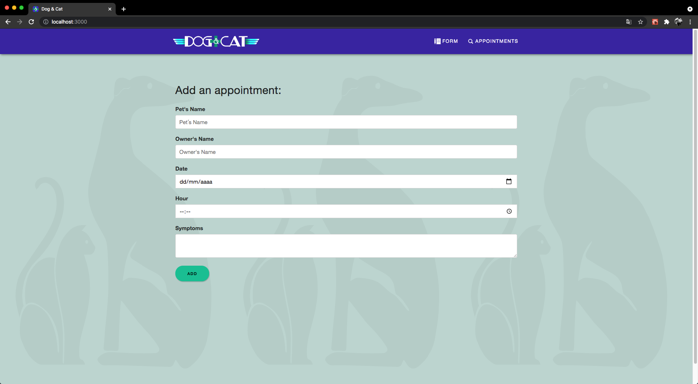

# <div align="center"> Dog & Cat Appointment App 📋</div>
## <a href="https://xenodochial-minsky-87265a.netlify.app/" target="_blank">LIVE DEMO</a>
<a href="">

</a>
<a href="">

</a>

<p align="center">Veterinary appointment app built with React. You can create & delete an appointment with it</p>

## 🛠️ Technologies

<ul>
  <li><a href="https://reactjs.org/">React</a></li>
  <li><a href="https://skeleton-framework.github.io/">Skeleton framework</a></li>
  <li><a href="https://www.adobe.com/la/products/illustrator.html">Adobe Illustrator</a></li>
</ul>

## ⚙️ Requirements

<ul>
  <li><a href="https://git-scm.com/">Git</a></li>
  <li><a href="https://nodejs.org/en/">Node.js</a></li>
  <li><a href="https://www.npmjs.com/">NPM</a></li>
</ul>

## 🚀 Installation

```
$ git clone https://github.com/AlexisTercero/DogCatAppointmentApp.git
$ npm install
$ npm start
```

The application will open in your browser on http://localhost:3000
